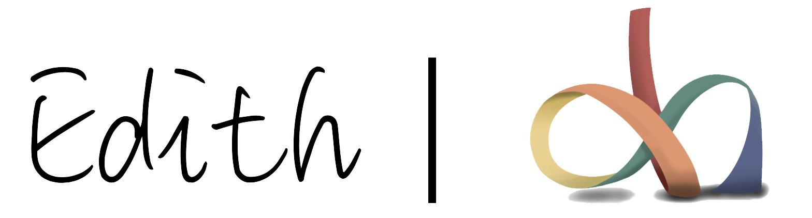

# DustinKsi -- Edith
[](https://dustinksi.github.io/Edith/)
[](https://github.com/dustinksi/Edith/blob/master/LICENSE)

#### Description
Edith is an Robotic Operation System framework developed by DustinKsi, Youibot Robotic Technology inc.



Marvel movies not only have world-class special effects, they are also inspiring. In "Avengers 4", Iron Man sacrificed himself for a peaceful world; And in "Spider-Man: Far From Home", Iron Man left this meme "Even dead, I'm the hero". As a great fan of Iron Man, I decided to design a robot system inspired by Iron Man's armor.
Finally, thanks to Baidu's Apollo open-source framework: CyberRT, EdithRT is designed based on that excellent framework.

```
╔═╗┬  ┬┌─┐┌┐┌  ╔╦╗┌─┐┌─┐┌┬┐   ╦┌┬┐  ╔╦╗┬ ┬┌─┐  ╦ ╦┌─┐┬─┐┌─┐
║╣ └┐┌┘├┤ │││   ║║├┤ ├─┤ ││   ║│││   ║ ├─┤├┤   ╠═╣├┤ ├┬┘│ │
╚═╝ └┘ └─┘┘└┘  ═╩╝└─┘┴ ┴─┴┘┘  ╩┴ ┴   ╩ ┴ ┴└─┘  ╩ ╩└─┘┴└─└─┘
```
"Even Dead, I'm The Hero" --- Spider-Man: Far From Home

Welcome to Edith's GitHub page!


## Table of Contents

1. [Getting Started](#getting-started)
2. [Installation](#Installation)

## Getting Started
Learn how to use Edith at its [Doxygen site](http://dustinksi.cn/edith/docs).

## Installation
```bash
mkdir -p your/cpp_project/path
git clone https://github.com/dustinksi/Edith.git --depth=1 && cd .. 
mkdir build && cd build
cmake .. -DBUILD_EDITH_TEST=true
make -j4
make test
sudo make install
```
ATTENTION: if your abseil library is not at correct version, Edith may not work well.

## Questions

You are welcome to submit questions and bug reports as [GitHub Issues](https://github.com/dustinksi/Edith/issues).

## Copyright and License

Edith is provided under the [Apache-2.0 license](https://github.com/dustinksi/Edith/blob/master/LICENSE).

## Connect with me
* [Have suggestions for our GitHub page?](https://github.com/dustinksi/Edith/issues)
* Interested in our turnKey solutions or partnering with us Mail me at: [dustinksi@126.com](mailto:dustinksi@126.com)